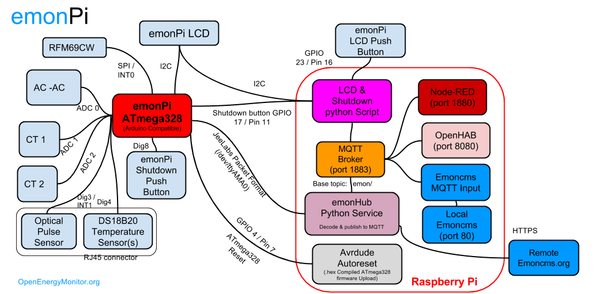

# emonPi Technical Overview

The emonPi is an all-in-one Raspberry Pi based energy monitoring unit making for a simple installation where Ethernet or WiFi is available at the meter location.

The emonPi can monitor two single-phase AC circuits using clip-on CT sensors. The emonPi can also monitor temperature, and interface directly with a utility meter via an optical pulse sensor.

**Features:**

- 2x CT Sensor inputs for single-phase AC electricity monitoring designed for use with the [100A SCT-013-000 CT sensor](https://shop.openenergymonitor.com/100a-max-clip-on-current-sensor-ct/)
- 1x AC voltage measurement using plug-in AC-AC adapter for real power calculation alongside current measurement from CT sensors. Designed for use with a [9V AC output voltage adapter](https://shop.openenergymonitor.com/ac-ac-power-supply-adapter-ac-voltage-sensor-uk-plug/)
- Support for multiple wired one-wire DS18B20 temperature sensors via RJ45 socket
- Support for pulse counting either wired or via Optical Pulse Sensor
- 433 MHz RFM69 radio transceiver for receiving data from additional energy monitoring or temperature and humidity nodes.
- The emonPi measurement board is based on Arduino (Atmega328). This talks to an integrated Raspberry Pi running our emonSD software stack on it's SD card.
- Full local data logging and visualisation capability using the emonSD Emoncms software stack. Data can also be sent to a remote emoncms server such as emoncms.org.
- Network connectivity via either Ethernet or WiFi.
- **LCD Display:** for easier setup, displays network IP address and sensor status.
- **Push button:** for shutdown and enabling/disabling SSH access.

## emonPi Internals

The emonPi is based on a RaspberryPi + emonPi measurement board. The emonPi measurement board is based on an ATmega328p 8-bit microcontroller running Arduino based firmware. The following video gives a good overview of what is inside an emonPi. Note that we currently ship RaspberryPi version 3b+ which has WiFi onboard rather than the older version featured in this video.

<iframe width="560" height="315" src="https://www.youtube.com/embed/lc2LzCZnySo" frameborder="0" allowfullscreen></iframe>

## System Overview

The following system diagram shows the main hardware and software components that make up the emonPi. On the left we have the emonPi measurement board based on the ATmega328 microcontroller with inputs from the different sensors, RFM69 433 MHz transceiver, button and I2C connection to the LCD. 

The Atmega328 microprocessor communicates with the Raspberry Pi via the internal UART serial port (/dev/ttyAMA0).

### RF

The emonPi uses the HopeRF RFM69CW RF module to receive data from other wireless nodes (emonTx, emonTH etc) using 433 MHz. We use the [JeeLib packet format](http://jeelabs.org/2011/06/09/rf12-packet-format-and-design/). Each RF node has a unique node ID but common network group (default 210). The ATmega328 runs a modified version of [JeeLabs RFM12Demo Sketch](http://jeelabs.net/projects/jeelib/wiki/RF12demo) to receive the data from radio nodes. Received radio packets are forwarded over serial and decoded on the RaspberryPi using EmonHub.

### Energy Monitoring

The emonPi measurement board includes input circuitry that converts the outputs from the ACAC adapter and CT sensors into signals that are compatible with the Analog to Digital converter (ADC). The ATmega328's 10-bit ADC samples the voltage and current channels sequentially. The Firmware running on the ATmega328 calculates real power, apparent power, power factor, Vrms and Irms of each channel. The real power reading is then pushed every 5s to the RaspberryPi for logging and visualisation.

To learn more about how the electricity monitoring works, see our Learn site here:

- [Learn: AC Power Theory](https://learn.openenergymonitor.org/electricity-monitoring/ac-power-theory/introduction)
- [Learn: CT Sensors, interfacing with an Arduino](https://learn.openenergymonitor.org/electricity-monitoring/ct-sensors/interface-with-arduino)
- [Learn: Measuring AC Voltage with an AC to AC power adapter](https://learn.openenergymonitor.org/electricity-monitoring/voltage-sensing/measuring-voltage-with-an-acac-power-adapter)

The full emonPi measurement board firmware can be accessed and downloaded here:

- [emonPi Discrete Sampling Firmware](https://github.com/openenergymonitor/emonpi/tree/master/firmware)
- The firmware uses the [EmonLib Discrete Sampling Library](https://github.com/openenergymonitor/EmonLib/)

The CT input's are designed for use with the [100A SCT-013-000 CT sensor](https://shop.openenergymonitor.com/100a-max-clip-on-current-sensor-ct/). This sensor has 2000 turns, which means that the current in the secondary is 2000 less than the current in the mains wire primary. The emonPi has a fixed sized burden resistor specified to match this sensor at 22 Ohms. It is possible to change this burden resistor if you wish to use a CT with a different current range or number of turns.

### Pulse Counting

Pulse counting on the emonPi uses the hardware interrupt IRQ1 on the ATmega328. The first hardware interrupt IRQ0 is used by the RFM69CW. Only one pulse counter input is possible per emonTx/emonPi. See guide [+ Add Optical Pulse Sensor](/setup/optical-pulse-sensor/) for more information on the optical pulse sensor.

The emonPi firmware implements a check for a minimum pulse width, this can be shortened on systems with more frequent pulses, see line: [https://github.com/openenergymonitor/emonpi/blob/master/firmware/src/src.ino#L96](https://github.com/openenergymonitor/emonpi/blob/master/firmware/src/src.ino#L96).

## RaspberryPi and emonSD

The emonPi Raspberry Pi runs our emonSD software stack which is based on [Raspbian Buster Lite](https://www.raspberrypi.org/downloads/raspbian/). The pre-built emonSD image is available to [purchase](https://shop.openenergymonitor.com/emonsd-pre-loaded-raspberry-pi-sd-card/) or [download](https://github.com/openenergymonitor/emonpi/wiki/emonSD-pre-built-SD-card-Download-&-Change-Log) or it is possible to built the image yourself using our automated build script, see [EmonScripts](https://github.com/openenergymonitor/EmonScripts).

EmonSD includes [emonHub](https://github.com/openenergymonitor/emonhub) which reads in the serial data from the emonPi measurement board and acts as a broker forwarding this data on to the local installation of emoncms via MQTT or to a remote server such as emoncms.org via HTTP. 

[Emoncms](https://github.com/emoncms/emoncms) is our open source web application for processing, logging and visualising energy, temperature and other environmental data. It is installed as part of the emonSD software stack and provides full local data logging and visualisation capabilities.

## Open Source

**emonPi Firmware** (see [Firmware Modification](/technical/compiling) 
[emonPi Discrete Sampling Firmware](https://github.com/openenergymonitor/emonpi/tree/master/firmware)

**emonPi Schematic and Board files:**  [https://github.com/openenergymonitor/emonpi/tree/master/hardware/emonpi/emonpi_V1_6](https://github.com/openenergymonitor/emonpi/tree/master/hardware/emonpi/emonpi_V1_6)

---

## emonPi Specification

| Attribute                          | Parameter  | Link |
|---|---|---|
| Error due to component and sensor tolerances | <11% | [Further info](https://openenergymonitor.org/emon/buildingblocks/emontx-error-sources)
| Measuring Current (CT)                  |50mA-96A | [Further info](https://openenergymonitor.org/emon/buildingblocks/ct-sensors-interface)
| Measuring Voltage (AC-AC)                  | 1st: 110VAC-254VAC / 2nd: 9VAC-12VAC| [Further info](https://openenergymonitor.org/emon/buildingblocks/measuring-voltage-with-an-acac-power-adapter)
| Sample period                       |  5s  | [Discrete sampling](https://github.com/openenergymonitor/emonpi/blob/master/firmware/firmware/firmware.ino)
| Frequency | 433Mhz | [Identify RF module](https://openenergymonitor.org/emon/buildingblocks/which-radio-module)
| RF range | 40m-100m | [Antenna testing](https://blog.openenergymonitor.org/2014/03/emontx-v3-antenna-testing/)
| Power Consumption | 1.5W-2.5W RasPi2 / 2W-4W RasPi3 |
| Operating temperature | -25 to +80 DegC | [Further info](https://www.raspberrypi.org/help/faqs/#performanceOperatingTemperature)
| Physical Dimensions | 10cm x 8.5cm x 10cm |

